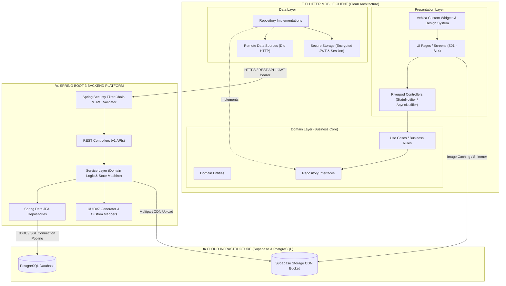
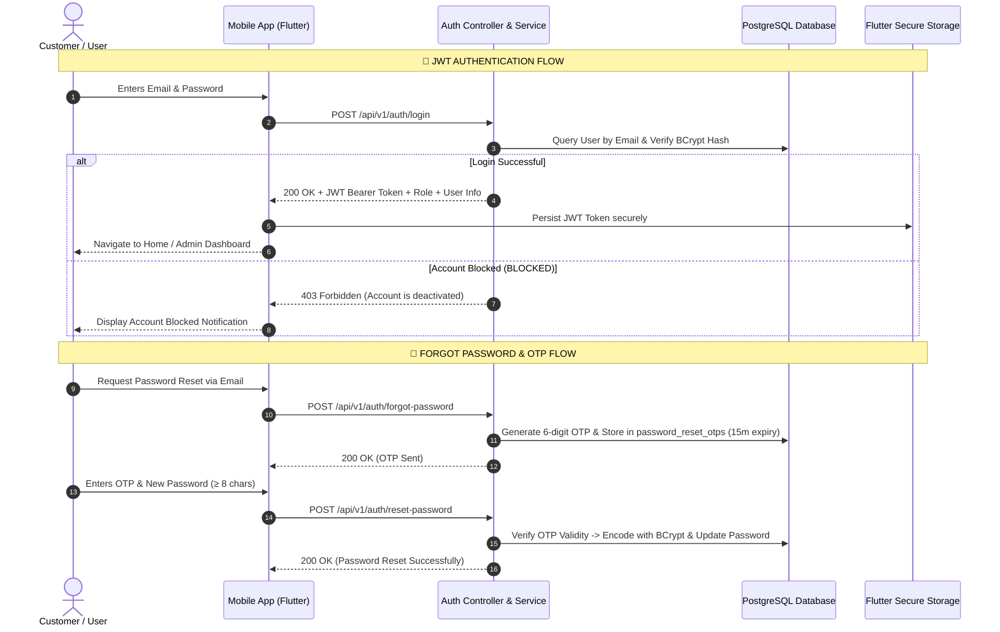
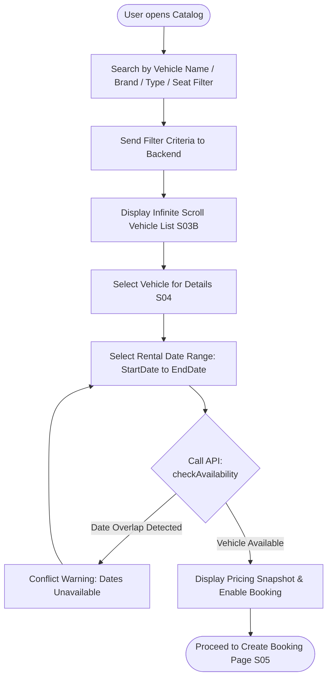
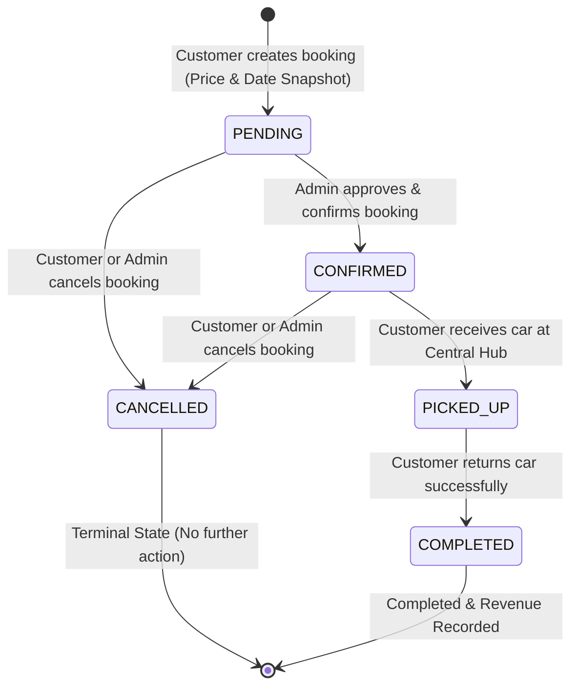
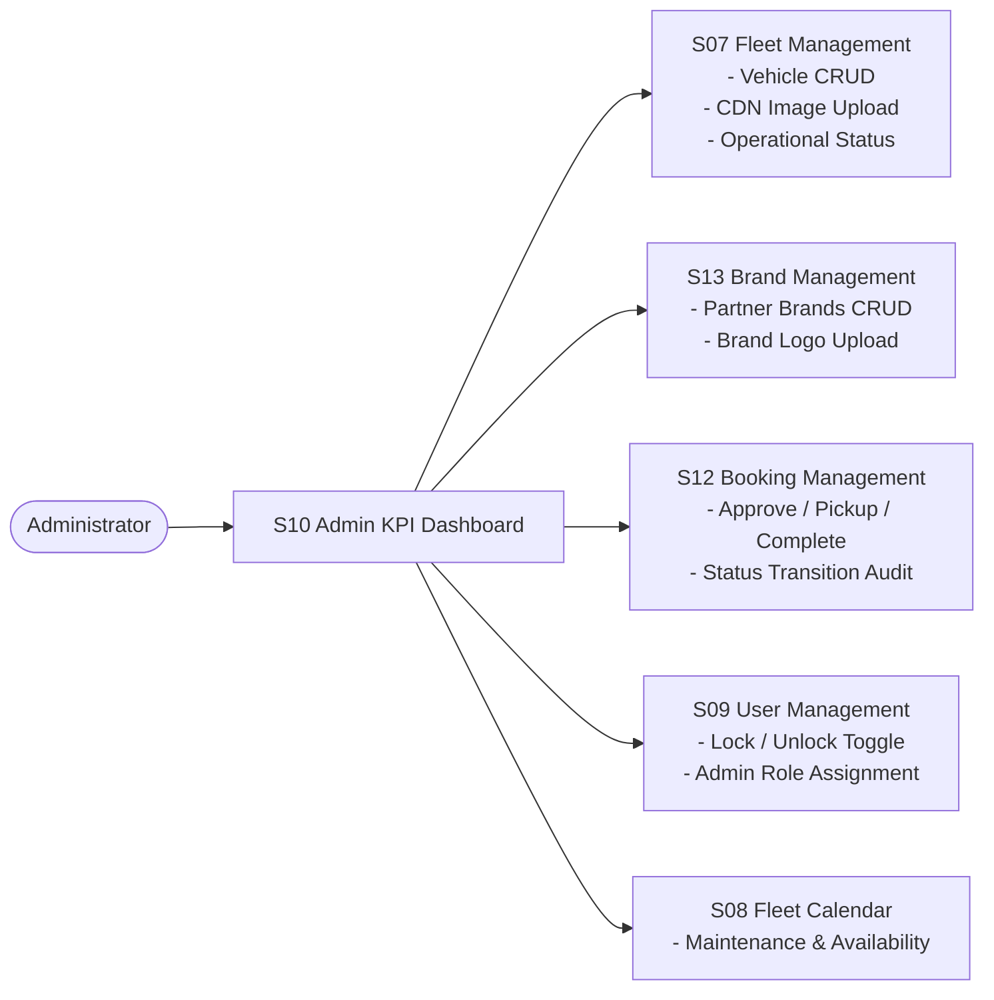

# VEHICA - Car Rental Mobile Application & Backend Platform

**PRM393 Final Project - Mobile Programming (Flutter & Spring Boot)**

Vehica is an enterprise-grade car rental platform built with **Clean Architecture**, featuring a modern **Flutter** mobile client (**Material 3 + Riverpod + Dio**) and a scalable **Spring Boot 3** REST API backend (**Java 21 + Spring Data JPA + Spring Security + JWT + PostgreSQL**).

---

## 👥 Project Team Members

| No. | Full Name | Student ID | Role |
| :---: | :--- | :---: | :--- |
| 1 | **Nguyễn Văn Đức Long** | `CS190175` | **Team Leader** |
| 2 | **Nguyễn Hoàng Thái Vinh** | `CE190384` | **Developer** |
| 3 | **Nguyễn Việt Tân** | `CE191195` | **Developer** |
| 4 | **Lê Khánh Đăng** | `CE180954` | **Developer** |
| 5 | **Nguyễn Quốc Kiệt** | `CE191198` | **Developer** |

---

## 🏛️ System Architecture Diagram

The system is designed following **Clean Architecture & Layered Enterprise Architecture**, strictly decoupling the Presentation Layer (Mobile Client), Business Logic & API Layer (Backend Platform), and Cloud Infrastructure (Database & CDN Storage):



---

## 🔄 Core Business Workflows

### 1. Authentication & Password Reset Flow



---

### 2. Vehicle Discovery & Real-Time Availability Check Flow



> **Booking Conflict Prevention Algorithm:**
> $$\text{isConflict} \iff (\text{existingStart} < \text{requestedEnd}) \land (\text{existingEnd} > \text{requestedStart})$$
> *Applied to bookings with statuses:* `PENDING`, `CONFIRMED`, `PICKED_UP`.

---

### 3. Booking Lifecycle & Finite State Machine (FSM)

The rental lifecycle strictly adheres to a **Finite State Machine (FSM)**:



- **Snapshot Data Integrity:** When a booking is created (`PENDING`), `pricePerDay`, `rentalDays`, and `totalAmount` are snapshotted permanently, guaranteeing accounting integrity even if base vehicle rates change later.
- **Audit Logging:** Every state transition automatically generates an immutable audit record in the `booking_status_history` table.

---

### 4. Admin Operations & Fleet Management Workflow



---

## 📁 Project Structure

```
Vehica/
├── backend/                               # Spring Boot 3 REST API Application
│   ├── pom.xml                            # Maven Dependencies (Java 21, Spring Boot 3)
│   ├── mvnw & mvnw.cmd                    # Maven Wrapper scripts
│   ├── src/main/java/com/vehica/
│   │   ├── config/                        # SecurityConfig, CorsConfig, OpenApiConfig
│   │   ├── common/                        # ApiResponse, PageResponse, Exceptions & Utils (UUIDv7)
│   │   ├── security/                      # JwtTokenProvider, JwtAuthenticationFilter, UserPrincipal
│   │   ├── user/                          # User Entity, OTP, DTOs, Service & Controllers
│   │   ├── vehicle/                       # Vehicle, Brand, Type, Image Entities, Availability Engine
│   │   ├── booking/                       # Booking & Audit History Entities, State Machine Service
│   │   └── statistics/                    # Revenue, Fleet Occupancy & KPI Analytics
│   └── src/main/resources/
│       ├── application.yml                # Base configuration & environment bindings
│       └── application-dev.yml            # PostgreSQL & Hibernate profiles
│
├── mobile/                                # Flutter Mobile Application
│   ├── pubspec.yaml                       # Dependencies (Riverpod, Dio, GoRouter, Material 3)
│   ├── lib/
│   │   ├── app/                           # App initialization, GoRouter routes & global providers
│   │   ├── core/                          # Constants, Material 3 Theme, ApiClient, Failures, Base Widgets
│   │   │   ├── theme/                     # Dark Slate & Emerald Teal themes & typography
│   │   │   └── widgets/                   # Reusable UI components (Buttons, Fields, Badges, Pickers)
│   │   └── features/                      # Feature-First Clean Architecture
│   │       ├── auth/                      # Login, Register, Forgot Password OTP flow
│   │       ├── profile/                   # Customer profile & account details
│   │       ├── vehicles/                  # Home Hub, Search Catalog, Vehicle Details & Availability
│   │       ├── bookings/                  # Booking creation, Customer history & Admin Management
│   │       ├── users/                     # Admin User Administration & Role management
│   │       └── dashboard/                 # Admin KPI Dashboard, Vehicle CRUD & Fleet Calendar
│   └── test/                              # Unit, Widget & Integration Tests
│
├── .gitignore                             # Global Git exclusion rules
└── .env                                   # Environment configuration & DB secrets
```

---

## 🚀 Quick Start Guide

### 1. Database & Environment Configuration
Configure PostgreSQL database credentials and environment parameters in the root `.env` file:
```bash
SPRING_DATASOURCE_URL=jdbc:postgresql://<HOST>:5432/<DATABASE>?sslmode=require
SPRING_DATASOURCE_USERNAME=<DB_USER>
SPRING_DATASOURCE_PASSWORD=<DB_PASSWORD>


---

### 2. Running the Backend (Spring Boot 3)

```bash
cd backend

# Windows:
.\mvnw.cmd spring-boot:run

# Linux / macOS:
./mvnw spring-boot:run
```

- **API Base URL:** `http://localhost:8080/api/v1`
- **Swagger UI Documentation:** `http://localhost:8080/swagger-ui.html`
- **OpenAPI Docs:** `http://localhost:8080/v3/api-docs`

---

### 3. Running the Mobile App (Flutter)

```bash
cd mobile
flutter pub get
flutter run
```

---

## 🧪 Testing & Automated Quality Assurance

### Backend Unit & Integration Tests (JUnit 5 + Spring Boot Test)
```bash
cd backend
.\mvnw.cmd test
```

### Flutter Unit & Widget Tests
```bash
cd mobile
flutter test
```
